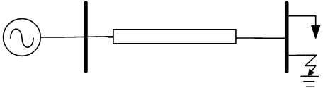
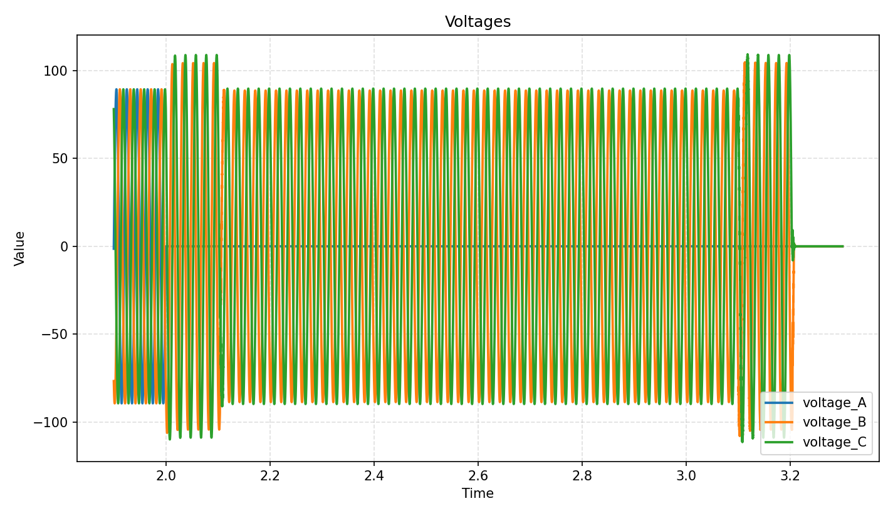
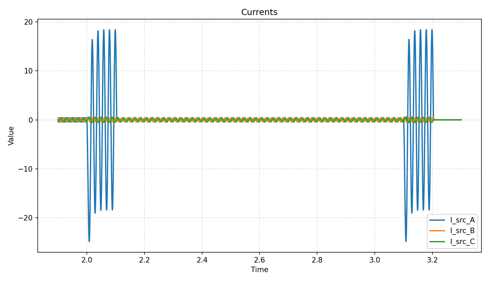

# EMTP demo

**作者：邹德虎**

这是一个基于**电磁暂态程序（EMTP）**原理，使用C++和Eigen库开发的电力系统暂态仿真项目。它采用**节点分析法**和**梯形积分法**对电路进行离散化和求解，能够模拟电力系统中的各种元件（如电源、线路、负荷、断路器）在故障和操作下的动态行为。

项目包含两部分：
1.  **C++ 仿真内核**: 负责进行电磁暂态计算并生成数据文件。
2.  **Python 绘图脚本**: (`curve.py`) 用于可视化仿真生成的数据。

---

## 项目特点
- **模块化设计**：每个电路元件（电阻、电感、线路等）都被封装为独立的类，易于扩展和维护。
- **面向对象**：利用C++的面向对象特性，通过继承和多态实现统一的设备接口。
- **高性能计算**：使用 **Eigen** 库进行高效的稀疏矩阵运算，处理大规模网络的导纳矩阵。
- **灵活的事件驱动**：可以方便地定义故障、开关操作等事件的时间和类型。
- **真实的断路器模型**：支持**电流过零开断**逻辑，更真实地模拟断路器行为。
- **先进的线路模型**：除了传统的集总参数PI模型，还实现了一个混合Bergeron-PI-ZIM模型（`HBPiZimLine`），这是作者（邹德虎）近期提出的新线路模型，用于更好的实现短线路解耦(50μs步长，线路小于15km)。
- **便捷的可视化**：配套的 Python 脚本可以一键生成高质量的电压、电流波形图。

---

## 代码结构

项目主要由以下几个部分组成：

- **`Devices.h` / `Devices.cpp`**: 定义了所有电路元件的类。
- **`Grid.h` / `Grid.cpp`**: 电网管理类，负责构建和管理系统**节点导纳矩阵 (G)**。
- **`Simulation.h` / `Simulation.cpp`**: 仿真器核心类，实现主时间步循环。
- **`Control.h` / `Control.cpp`**: 仿真控制类，用于设置仿真参数和事件序列。
- **`Curve.h` / `Curve.cpp`**: C++数据记录类，将仿真结果输出到 `.dat` 文件。
- **`main.cpp`**: C++程序入口，完成电路搭建、参数设置和仿真启动。
- **`curve.py`**: Python绘图脚本，用于读取 `.dat` 文件并生成波形图。

---

## 核心功能介绍

### 元件建模
本项目遵循EMTP的核心思想，将所有储能元件（电感、电容）通过**梯形积分法**进行离散化。在每个时间步 `dt`，这些元件都可以被等效为一个**诺顿电路**，即一个**等效电导**并联一个**历史电流源**。通过这种方式，整个微分方程组在每个时间步都被转化为一个线性代数方程组 **`G_eq * V(t) = I_eq(t)`** 进行求解。

### 仿真流程
仿真器 `Simulation` 类中的 `run()` 方法执行主时间步循环，依次进行事件检查、矩阵更新、历史向量更新、求解电压、设备状态更新和数据采样等步骤。

---

## 如何运行一个仿真

以下步骤将指导您如何从零开始搭建电路并完成一次完整的仿真。

### 第一步：环境配置
- **C++ 环境**: 确保您已正确配置了 **Eigen** 库。您需要将 Eigen 的头文件目录添加到您的编译器的包含路径中。
- **Python 环境**: 确保安装了 pandas 和 matplotlib。


### 第二步：搭建电路系统
在 main.cpp 中，实例化 Grid 类并向其中添加各种 Device，包括电源、线路、负荷、断路器、故障开关等。

### 第三步：设置仿真参数和事件
在 Control 类或其实例中设置仿真参数（如 dt, t_end），并定义故障事件序列和需要录制的电压/电流波形。

### 第四步：配置断路器时序
如果您在电路中添加了 CircuitBreakerPhase，可以为其安排一系列动作，并将其注册到仿真器中。

### 第五步：编译和运行
配置好您的构建系统（如CMake或Makefile），确保链接了Eigen库。然后编译并运行 C++ 程序。
运行后，程序将在当前目录下生成 curve_V.dat 和 curve_I.dat 两个数据文件。

### 第六步：使用 Python 脚本绘图

将 curve.py 脚本与生成的 .dat 文件放在同一个目录下，然后直接运行：

```python
python curve.py
```

## 典型算例

在main.cpp文件包含了一个简单的典型算例。模拟了中性点接地的110kV系统，电网结构如图：




在程序中已经设置了：
1. 2.0 秒，发生A相永久性故障
2. 2.10秒，保护动作，切除A相断路器
3. 3.10秒，重合闸动作，合上A相断路器
4. 3.2秒，合于故障加速跳开，断开三相断路器。

负荷母线的电压曲线如图，单位kV：



电源产生的电流曲线如下，单位kA：




